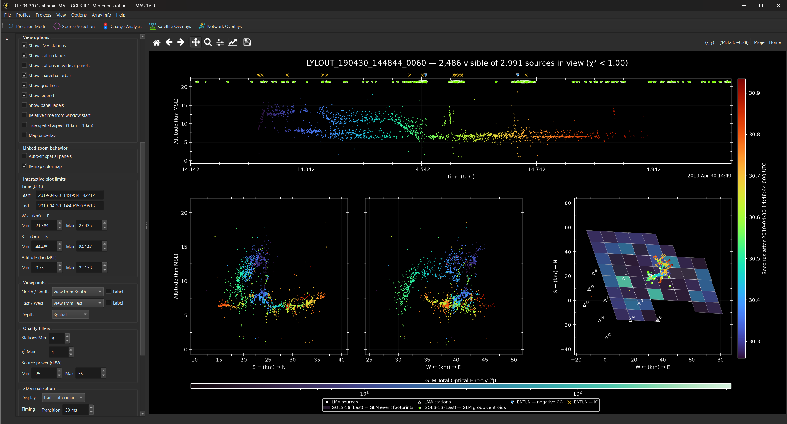
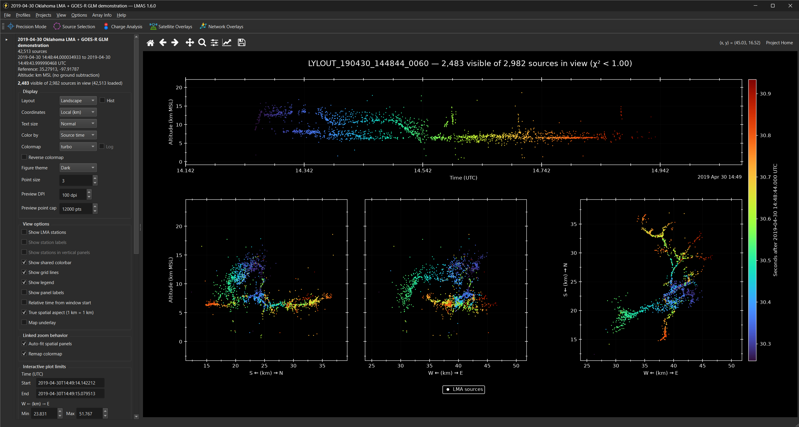
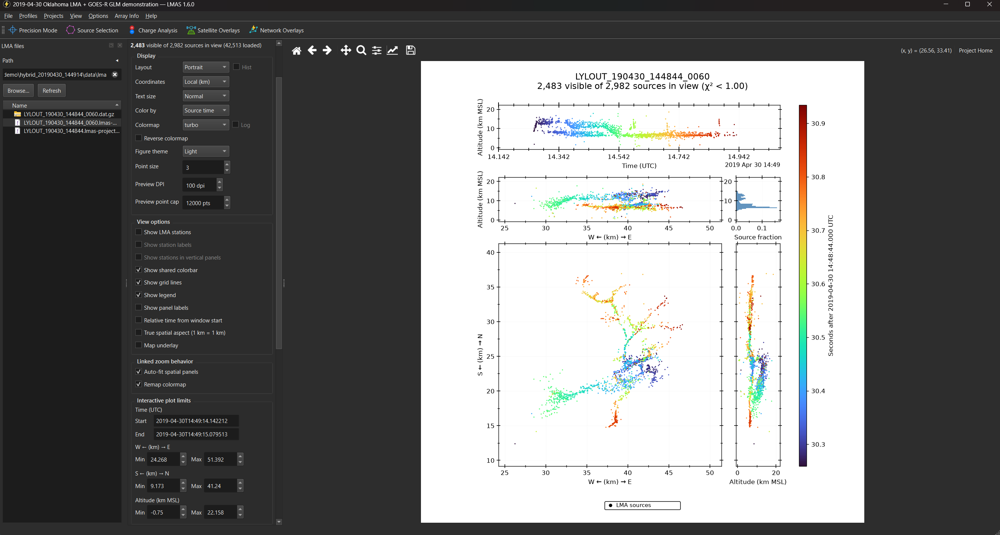
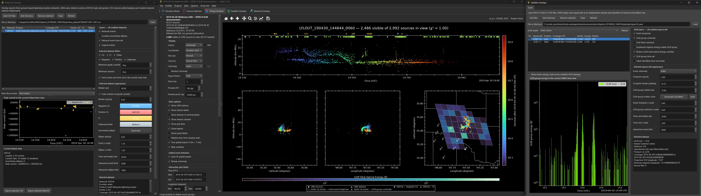

# Lightning Mapping Array Suite (LMAS) 1.6.0

LMAS is an open-source Python application for interactive, reproducible analysis and presentation of already-solved Lightning Mapping Array data. It combines linked LMA views with analysis tools, GLM overlays, ground-network overlays, Projects and Profiles, publication figures with selectable viewpoints, and live/saved animations.

LMAS builds on the foundations of [xlma-python](https://github.com/deeplycloudy/xlma-python), including its `pyxlma` package, and [glmtools](https://github.com/deeplycloudy/glmtools), developed by Eric Bruning and collaborators. LMAS’s native readers and portions of its plotting and GLM geometry implementation derive from those projects. LMAS adds an integrated desktop application, linked analysis workflows, Projects and Profiles, overlay management, and scientific exports.

[](docs/images/main_window_overlays_detail.png)

*Detailed LMAS view combining LMA sources and labeled stations with GOES-16 GLM event footprints and group centroids, plus ENTLN IC and CG detections.*

[](docs/images/main_window_landscape_dark.png)

## Highlights

- Native readers for solved LMA data and GOES GLM Level 2 LCFA products.
- Linked Landscape and Portrait views with coordinated zooming, panning, and filtering.
- Precision Mode for exact source-to-source measurements. 
- Linked lasso selection for building and editing reusable source groups.
- Leader-polarity assignment for Charge Analysis. 
- Exportable analysis products.
- Separate Satellite Overlays and Network Overlays workspaces.
- GLM footprints, centroids, time rails, legends, and optical-energy colorbars.
- Ground-network detections with IC/CG styling, peak-current scaling, uncertainty ellipses, and time rails.
- Publication-ready figures, animations, Projects, Profiles, batch workflows, and command-line tools.
- Light and dark themes.
- Offline coastline, country, state/province, and county boundaries.

## Interface examples

### Portrait layout and file browser

[](docs/images/main_window_portrait_light.png)

### Satellite and network overlays

[](docs/images/network_and_satellite_overlays.png)

## Installation

LMAS is available in two forms:

- **Packaged release:** recommended for users who want to install and run LMAS.
- **Source repository:** intended for developers.

### Packaged release

Download the latest packaged version from the
[LMAS Releases page](https://github.com/RealLightningCowboy/lmas/releases/latest).

For LMAS 1.6.0, under **Assets**, download:

`LMAS_1_6_0.zip`

For later releases, download the corresponding versioned LMAS archive.

Extract the archive. LMAS 1.6.0 is validated with Python 3.13, and a dedicated Conda environment is recommended.

Create the environment with Mamba:

```bash
mamba create -n lmas -c conda-forge python=3.13 pip
conda activate lmas
```

Conda may be used instead:

```bash
conda create -n lmas -c conda-forge python=3.13 pip
conda activate lmas
```

Open a terminal in the extracted LMAS directory (`LMAS_1_6_0` for this release) and confirm that the active Python and pip belong to the new environment:

```bash
python -c "import sys; print(sys.executable)"
python -m pip --version
```

Install LMAS:

```bash
python install.py
```

The installer installs the bundled LMAS wheel and creates the platform launcher where supported.

Start LMAS with:

```bash
lma gui
```

Open the included demonstration with:

```bash
lma gui --demo
```

### From source

Developers may clone the repository and install LMAS directly from the source tree:

```bash
git clone https://github.com/RealLightningCowboy/lmas.git
cd lmas
```

Create and activate a Python 3.13 environment as shown above, then install the full dependency set and LMAS in editable mode:

```bash
python -m pip install -r requirements/full.txt
python -m pip install -e .
```

Start the application with:

```bash
lma gui
```

See [INSTALLATION.md](INSTALLATION.md) for additional environment options, dependency groups, optional visualization support, direct wheel installation, launcher details, and troubleshooting.

## Try the demonstration

Run:

```bash
lma gui --demo
```

The included one-minute Oklahoma case contains LMA data and GOES-16/GOES-17 GLM files. Overlay datasets are disabled by default so users can enable and explore them deliberately.

## Documentation

- [User Manual](USER_MANUAL.md) — complete GUI and workflow guide
- [Installation Guide](INSTALLATION.md) — installation, environment, and launcher options
- [CLI Reference](CLI_REFERENCE.md) — command-line reference
- [Native Readers](NATIVE_READERS.md) — concise LMA and GLM reader overview
- [Network Overlays](NETWORK_OVERLAYS.md) — supported network-overlay workflow
- [Polarity Product Format](POLARITY_PRODUCT_FORMAT.md) — exported Charge Analysis product format
- [Known Limitations](KNOWN_LIMITATIONS.md) — current scientific and platform limitations
- [Lineage and Attribution](LINEAGE_AND_ATTRIBUTION.md) — software lineage and attribution details

## License and attribution

Original LMAS code and documentation are distributed under the MIT License in `LICENSE`, copyright R. Stetson Reger. Upstream and bundled materials retain their own notices in `licenses/`; `licenses/README.md` explains which terms apply to each component.

See `CREDITS.md`, `DEVELOPMENT_PROVENANCE.md`, `LINEAGE_AND_ATTRIBUTION.md`, and `THIRD_PARTY_NOTICES.md` for fuller attribution and provenance.